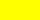
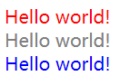

<h2>CSS简介</h2>

**CSS（Cascading Style Sheets）：层叠样式表**

<h3>CSS引入方式</h3>

<h4>1、行内样式</h4>

```html
<!DOCTYPE html>
<html>
	<head>
		<meta charset="utf-8">
		<title></title>
	</head>
	<body>
		<div style="color: red">Hello world!</div>
	</body>
</html>
```

<h4>2、内联样式</h4>

```html
<!DOCTYPE html>
<html>
	<head>
		<meta charset="utf-8">
		<title></title>
        <style>
            div {
                color: red;
            }
        </style>
        
	</head>
	<body>
		<div>Hello world!</div>
	</body>
</html>
```

<h4>3、外部样式</h4>

**style.css文件内容**

```css
div {
	color: red;
}
```

**index.html文件内容**

```html
<!DOCTYPE html>
<html>
	<head>
		<meta charset="utf-8">
		<title></title>
		<link rel="stylesheet" href="style.css">
	</head>
	<body>
		<div>Hello world!</div>
	</body>
</html>
```

<h3>引用优先级</h3>

CSS引入，按照优先级排列分为：

**行内样式 > 内联样式 > 外部样式**

提升优先级：可通过 **!important** 可以提升样式优先级

```html
<!DOCTYPE html>
<html>
	<head>
		<meta charset="utf-8">
		<title></title>
        <style>
            div {
                color: red !important;
            }
        </style>
        
	</head>
	<body>
		<div>Hello world!</div>
	</body>
</html>
```

<h3>CSS颜色设置</h3>

**颜色表示方法**

| 颜色                   | 颜色十六进制 | 颜色RGB          | 颜色英文名称 |
| ---------------------- | ------------ | ---------------- | ------------ |
|     | #FF0000      | rgb(255,0,0)     | red          |
|   | #000000      | rgb(0,0,0)       | black        |
|    | #808080      | rgb(128,128,128) | grey         |
|   | #008000      | rgb(0,128,0)     | green        |
|   | #FFFFFF      | rgb(225,255,255) | white        |
|  | #FFFF00      | rgb(255,255,255) | yellow       |
|    | #0000FF      | rgb(0,0,255)     | blue         |

**举个栗子：**

```html
<!DOCTYPE html>
<html>
<head>
    <meta charset="utf-8">
    <title></title>
    <style>
        .s1 {
            color: red;
        }

        .s2 {
            color: #808080;
        }
        
        .s3 {
            color: rgb(0, 0, 255);
        }
    </style>

</head>
<body>
    <div class="s1">Hello world!</div>
    <div class="s2">Hello world!</div>
    <div class="s3">Hello world!</div>
</body>
</html>
```

**效果图：**



