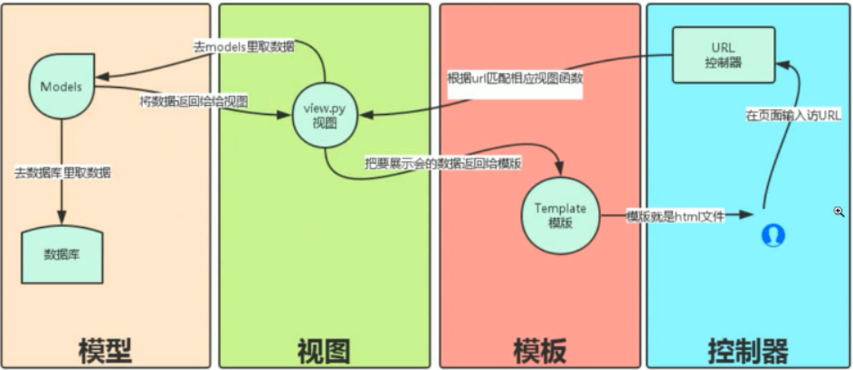

### MVC模式（Model View Controller）

-   myweb目录（Python Package）
    -   urls.py文件
    -   models.py文件
    -   controller.py文件
    -   view目录（Python Package）
        -   .html文件


**models.py**文件：存放数据库交互代码

**controller.py**文件：存放处理函数

```python
# -*- coding:utf-8 -*-
# @Author:Liu Guoyang
# @Time  :2019/5/5 21:52
# @File  :controller.py

import time


def current_time(request):
    f = open("current_time.html", 'rb')
    data = f.read()

    cur_time = time.ctime(time.time())
    data = str(data, "utf8").replace("!cur_time!", cur_time)

    return [data.encode()]
```

**urls.py**文件：路径分配

```python
# -*- coding:utf-8 -*-
# @Author:Liu Guoyang
# @Time  :2019/5/5 21:50
# @File  :urls.py

from .controller import current_time  # 从controller文件中导入current_time函数（方法）


def routers():
    urlpatterns = (
        ('/current_time', current_time),
    )

    return urlpatterns
```

**view目录**：存放各个HTML文件


### MTV模式（Model Template View）

