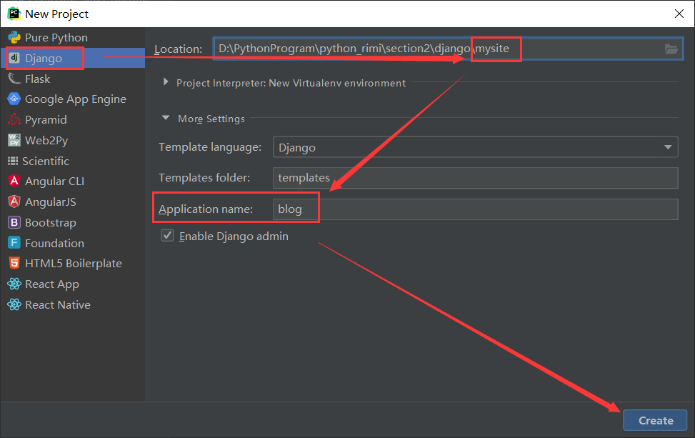

### 创建Django项目

**django-admin startproject** *mysite*

```
mysite
	__init__.py
	settings.py
	urls.py
	wsgi.py
```


### 创建Django应用

**python manage.py startapp** *blog*

```
blog
	migrations
		__init__.py
	__init__.py
	admin.py
	apps.py
	models.py
	tests.py
	views.py
```


### PyCharm快捷创建Django项目和应用




#### blog > views.py

```python
from django.shortcuts import render, HttpResponse
import datetime


def cur_time(request):
    times = datetime.datetime.now()
    # return HttpResponse("<h1>OK</>")
    return render(request, "cur_time.html", {"abc": times})  # 调用render方法进行渲染
    # 第一个参数必须是request
    # 第二个参数是目标html文件路径
    # 第三个参数是一个字典，运用模板语言，当html中遇到"abc"字段，则可传入times的值进行替换
```

#### mysite > urls.py

```python
from django.contrib import admin
from django.urls import path

from blog import views

urlpatterns = [
    # path(正则表达式，views视图函数，参数，别名)
    path(r'admin/', admin.site.urls),
    path(r'cur_time/', views.cur_time),
    # 通过正则表达式匹配字段
    # 第二个参数，字段与所执行的函数进行绑定（从views.py中导入）
]
```

#### templates > cur_time.html

```html
<!DOCTYPE html>
<html lang="en">
<head>
    <meta charset="UTF-8">
    <title>Title</title>
</head>
<body>

<h1>当前时间为：{{ abc }}</h1>
{#使用模板语言，用双花括号{{  }}来表示字段#}
</body>
</html>
```

### 启动Django项目

**python manage.py runserver** 默认本机作为服务器，端口默认8000

**python manage.py runserver 127.0.0.1 8000** 指定IP地址和端口号


在浏览器中输入：

**localhost:8000/cur_time**

或**127.0.0.1:8000/cur_time**

