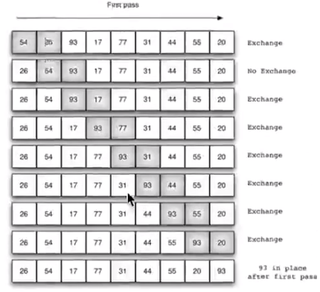

## 冒泡排序算法

### 算法原理

-   比较相邻的元素。如果第一个比第二个大，就交换他们的位置。
-   对每一对相邻元素做同样的工作，从开始第一对到结尾的最后一对。在这一点，最后的元素应该会是最大的数。
-   针对所有的元素重复以上的步骤，除了最后一个。
-   持续 每次对越来越少的元素重复上面的步骤，直到没有任何一对数字需要比较。




### 时间复杂度

-   最好的时间复杂度：**O(n)**。初始状态是正序的。

-   最坏的时间复杂度：**O(n^2)**。初始状态是逆序的。

-   冒泡排序总的平均时间复杂度为：**O(n^2)**。


### python3代码实现

```python
list1 = [1, 2, 3, 4, 5, 6, 7, 8]

for i in range(len(list1)):
    for j in range(len(list1)):
        if list1[i] >= list1[j]:
            list1[i], list1[j] = list1[j], list1[i]

print(list1)  # [8, 7, 6, 5, 4, 3, 2, 1]
```

