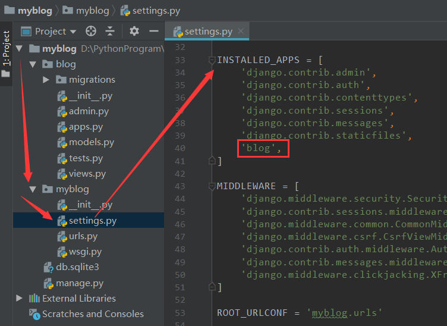

## 创建应用

### 创建步骤

#### 打开命令行，进入项目中manage.py同级目录

#### 命令行输入：python manage.py startapp blog

#### 添加应用名到settings.py中的INSTALLED_APPS里（应用名不可和python内置模块相同）



### 应用目录结构介绍

```
migrations
	__init__.py
__init__.py
admin.py
apps.py
models.py
test.py
views.py
```

#### migrations

数据移植（迁移）模块

#### admin.py

该应用的后台管理系统配置

#### apps.py

该应用的一些配置

django-1.9以后自动生成

#### models.py

数据模块

使用ORM框架

类似于MVC结构中的models（模型）

#### tests.py

自动化测试模块

django提供了自动化测试功能

在这里编写了测试脚本

#### *views.py

执行响应的代码所在模块

代码逻辑处理的主要地点

项目中大部分代码在这里编写


在settings中添加app——>编辑blog.views——>配置urls