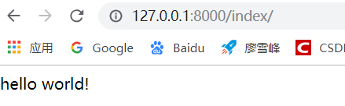

### 创建应用

### 进入myblog项目下的blog应用目录中

#### 编辑blog.views.py文件

-   每个响应对应一个函数，函数必须返回一个响应
-   函数必须存在一个参数，一般约定为request
-   每一个响应（函数）对应一个URL

#### 添加url

-   每个URL都以url的形式写出来
-   url函数放在urlpatterns列表中
-   url函数三个参数：URL（正则表达式），对应方法，名称

#### 打开服务器

**python manage.py runserver**

#### 在浏览器中输入127.0.0.1:8000

