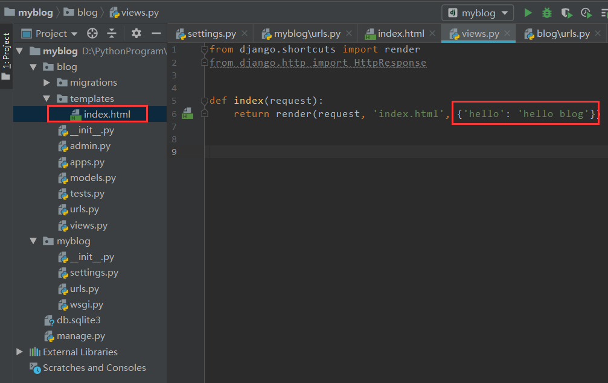
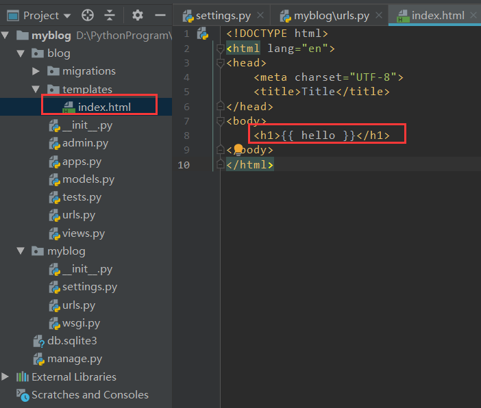

### 什么是Templates

HTML文件

使用了Django模板语言（Django Temlates Language，DTL）

可以使用第三方模板（如Jinja2）

### 步骤

在APP的根目录下创建名叫Templates的目录

在该目录下创建HTML文件

在views.py中返回一个render()

### DTL初步使用

-   **render()**函数中支持一个**dict类型**参数
-   该字典是后台传递到模板的参数，**键为参数名**
-   在模板中使用{{ **参数名** }}来直接使用

### Django查找Templates

Django按照**INSTALLED_APPS中的添加顺序**查找Templates

不同APP下Templates目录中的同名.html文件会造成冲突

### 解决Templates冲突方案

在APP的Templates目录下创建以APP名为名称的目录

将html文件放入新创建的目录下

在新建Templates后，在templats文件目录下再新建一个**与应用同名**的文件目录，把html文件模板全部放入到新建的文件目录下